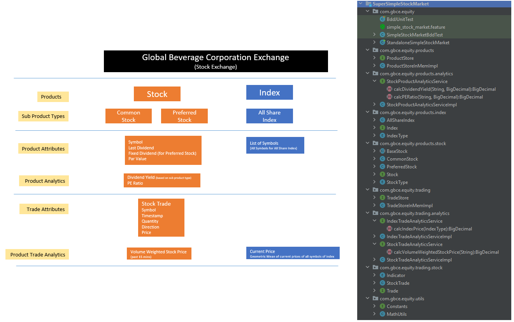
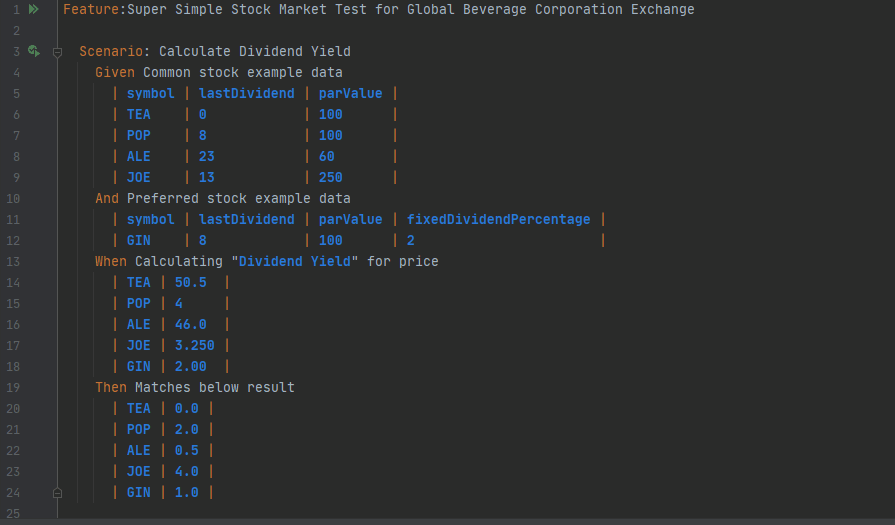

Super Simple Stock Market - Global Beverage Corporation Exchange
====================================================================

Super Simple Stock Market is sample Analytic and Trade Recording platform for Global Beverage Corporation Exchange stock market. 
Key Features :
* Supports Common and Preferred Equity Stock Product
* Supports All Share Index to provide stock market summary
* Supports Adding Trade Records
* Support Analytic Functions - DividendYield, PERatio, VolumeWeightedStockPrice, IndexPrice 

Requirement
----------------------------

Provide working source code that will :-

a. For a given stock,

    i. Given any price as input, calculate the dividend yield
    
    ii. Given any price as input, calculate the P/E Ratio
    
    iii. Record a trade, with timestamp, quantity of shares, buy or sell indicator and traded price
    
    iv. Calculate Volume Weighted Stock Price based on trades in past 15 minutes

b. Calculate the GBCE All Share Index using the geometric mean of prices for all stocks

Tech Analysis/Design
----------------------------
Technology : Java , Maven , Cucumber  IDE : Intellij

Testing Using BDD - Acceptance Testing
--------------------------------------

Unit testing performed using Cucumber BDD feature/Scenario

* [Test Output](docs/Test-Output.txt)
* [Test BDD](src/test/resources/com/gbce/equity/simple_stock_market.feature) 
* [Test Impl](src/test/java/com/gbce/equity/SimpleStockMarketBddTest.java)  

How to build
-------------

To build the project Maven and JDK 8 are required. 
Maven command to Build project:

    mvn clean install

Maven command to run test :

    mvn clean test
    
The project also has a stand alone main program to run with default dataset - 
com/gbce/equity/StandaloneSimpleStockMarket.java

    /**
     * Standalone Simple Stock Market Impl with test data
     * Logic :
     *
     * Create ProductStore
     * Create TradeStore
     *
     * Create Stocks
     * Create Index
     *
     * Create StockProductAnalyticsService
     * Create StockTradeAnalyticsService
     * Create IndexTradeAnalyticsService
     *
     * Use services to  perform calculations
     */